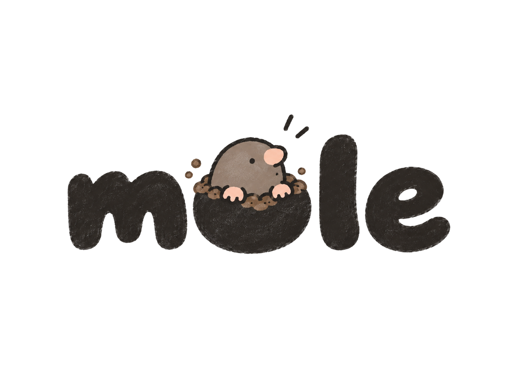
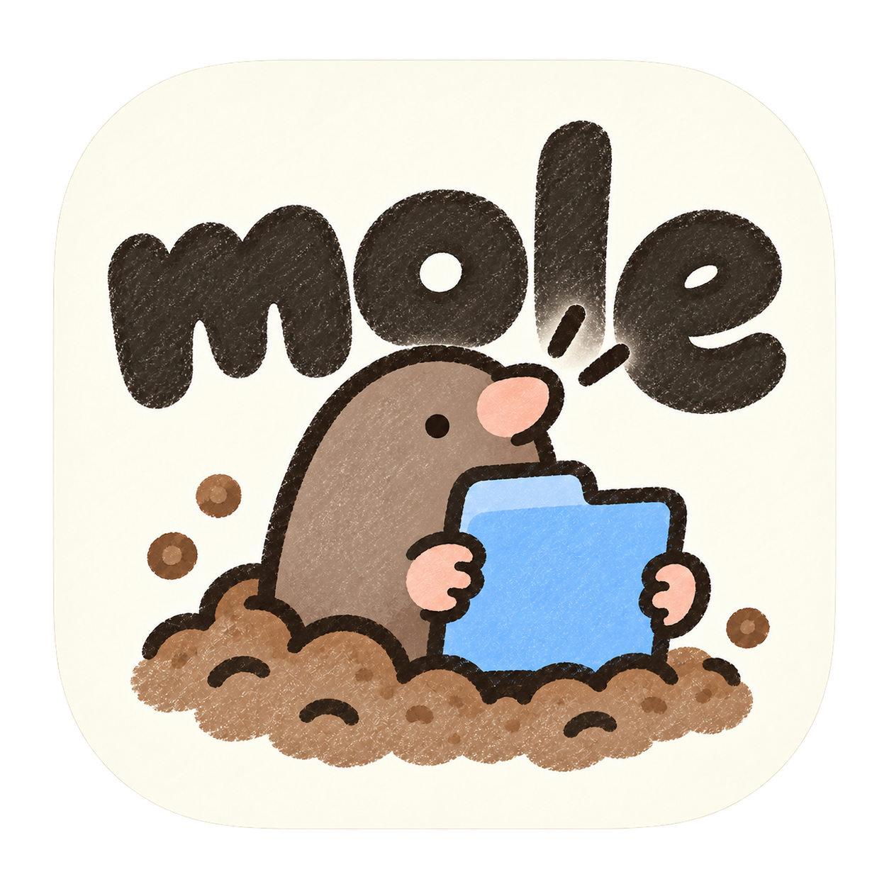
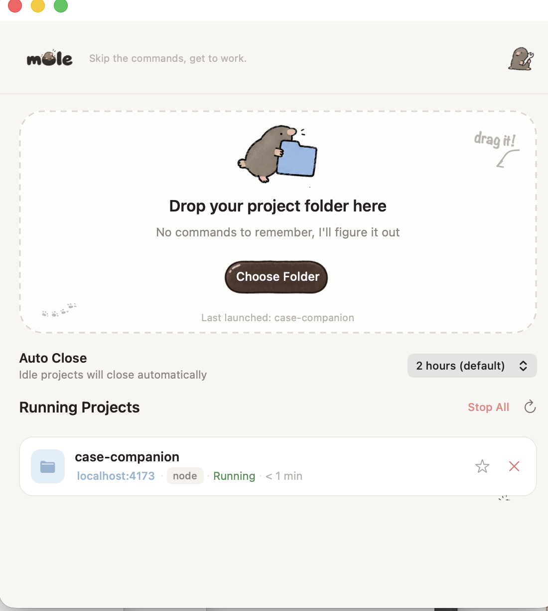

[English](README.md) | [繁體中文](README.zh-TW.md) | [简体中文](README.zh-CN.md) | [日本語](README.ja.md) | [한국어](README.ko.md) | [Français](README.fr.md) | [Español](README.es.md) | Deutsch | [Português (Brasil)](README.pt-BR.md)

<p align="center">
  
</p>

<p align="center">Keine Befehle mehr, einfach loslegen.<br>Skip the commands, get to work.</p>

<p align="center">
  
</p>

<p align="center">
  
</p>

Ein kleines macOS-Tool: Du ziehst einen Projektordner hinein, und mole findet heraus, um welche Art von Projekt es sich handelt, startet es im Hintergrund und öffnet deinen Browser — ohne dass sich ein Haufen Terminal-Fenster ansammelt. Du siehst außerdem genau, welche localhost-Dienste gerade laufen, und kannst sie mit einem Klick stoppen.

## Warum ich das gemacht habe

<p align="center">
  
</p>

Ich bin kein professioneller Entwickler. Nach viel Vibe Coding hatte ich immer mehr Projekte, konnte mir die Startbefehle nicht mehr merken und verlor den Überblick, welche localhost-Ports überhaupt noch liefen.

Und ich wollte nicht jedes Mal wieder eine KI fragen müssen, nur um ein Projekt zum Laufen zu bringen.

Also habe ich mole gebaut. Ordner reinziehen, den Rest erledigt die App.

## Funktionen

- **Start per Drag-and-Drop**: Ordner ins Fenster ziehen oder „Ordner wählen" benutzen — mole erkennt den Projekttyp und startet ihn automatisch. Unterstützt Node.js (npm / pnpm / yarn / bun), statische Websites, Python, Ruby / Rails, Go, Rust, Docker Compose, Deno, PHP, Flutter, Java / Kotlin, .NET, Chrome-Erweiterungen, native macOS-Apps und mehr
- **Läuft komplett im Hintergrund**: keine sich stapelnden Terminal-Fenster mehr — die Ausgabe des Startbefehls wird weiterhin protokolliert, du musst sie dir nur nicht mehr ansehen
- **Liste laufender Projekte**: jeder Dienst übernimmt automatisch den `<title>` oder das Favicon der Seite, damit du deine Projekte auf einen Blick unterscheiden kannst; „Dauerhaft aktiv" (⭐️) und „Stoppen" (✕) sind sichtbare, klickbare Symbole — kein Menü, das man erst öffnen muss
- **Automatisches Schließen**: schließt untätige Dienste nach einer einstellbaren Zeit automatisch; angeheftete (dauerhaft aktive) Projekte werden dabei nie angetastet
- **Oberfläche in 9 Sprachen**: English, 繁體中文, 简体中文, 日本語, 한국어, Français, Español, Deutsch und Português (Brasil) — sofortiger Sprachwechsel in den Einstellungen, ohne Neustart. Die Sprachliste erscheint immer in derselben festen Reihenfolge, jede Sprache in ihrem eigenen nativen Namen
- **Automatische Updates**: prüft beim Start auf eine neuere Version, mit Download und Installation per Klick

## Screenshots

<p align="center">
  
</p>

## Funktionsweise

Ziehst du einen Ordner auf mole, passiert Folgendes:

1. Der Inhalt des Ordners (`package.json`, `Gemfile`, `go.mod`, `Dockerfile`, …) wird geprüft, um den Projekttyp zu bestimmen
2. Der passende Startbefehl wird erstellt und im Hintergrund ausgeführt (die Ausgabe geht in eine Log-Datei, es öffnet sich kein Terminal-Fenster)
3. Es wird laufend geprüft, ob ein neuer localhost-Port aktiv wird
4. Sobald einer erkannt wird, öffnet sich automatisch der Browser — gibt es keinen Web-Port zu erkennen (native App, reiner Backend-Dienst usw.), wird der Start sofort als abgeschlossen markiert

## Installation

Erfordert macOS 12 oder neuer.

### Option 1: App herunterladen

1. Die aktuelle `mole-x.x.x.dmg` von [Releases](https://github.com/ST6AR1/mole/releases/latest) herunterladen
2. Das DMG öffnen und die App in `Applications` ziehen
3. Da es kein kostenpflichtiges Apple-Developer-Zertifikat gibt, erscheint beim ersten Start eine Warnung „Entwickler nicht verifiziert" — im Finder **bei gedrückter Control-Taste auf die App klicken → Öffnen**, oder unter **Systemeinstellungen → Datenschutz & Sicherheit** zulassen. Das passiert nur beim ersten Mal

### Option 2: Aus dem Quellcode bauen

```bash
xcode-select --install   # falls noch nicht installiert
git clone https://github.com/ST6AR1/mole.git
cd mole
./build.sh
```

Dadurch entsteht `mole.app` im Projektordner — zum Verwenden einfach in `Applications` ziehen.

## Unterstützte Plattformen

Nur macOS 12 (Monterey) und neuer, sowohl auf Apple Silicon als auch auf Intel.

## Datenschutz

mole läuft vollständig auf deinem eigenen Rechner. Es sammelt oder überträgt keine Nutzungsdaten oder Projektinhalte; die einzigen Netzwerkaufrufe sind die Prüfung auf GitHub, ob beim Start eine neuere Version vorliegt (ein reiner Lesezugriff auf die Releases-API — es werden keine Geräteinformationen übertragen), sowie das Öffnen einer vorausgefüllten GitHub-Issue-Seite, wenn du selbst auf „Problem melden" klickst.

## Häufige Fragen

**F: Es bleibt bei „Waiting for localhost" hängen — was jetzt?**
A: Handelt es sich um einen reinen Backend-Dienst, eine Datenbank oder eine native App, gibt es von vornherein keinen Web-Port zu finden, und der Vorgang wird nach kurzer Zeit automatisch als abgeschlossen markiert. Läuft noch `npm install`, wird gerade ein Docker-Image gezogen oder ein anderer Einrichtungsschritt ausgeführt, im Log bzw. Terminal den tatsächlichen Fortschritt prüfen, statt den Ordner erneut hineinzuziehen.

**F: Ich habe die falsche Sprache gewählt und kann die Oberfläche nicht mehr lesen — was tun?**
A: Im Sprach-Dropdown der Einstellungen wird jede Sprache in ihrem eigenen nativen Namen angezeigt (z. B. „Français", „日本語") und erscheint immer in derselben festen Reihenfolge, sodass du die für dich lesbare Sprache findest, ohne vorher irgendetwas anderes entziffern zu müssen.

**F: Welche Projekttypen werden unterstützt?**
A: Node.js (npm / pnpm / yarn / bun), statische Websites, Python, Ruby / Rails, Go, Rust, Docker Compose, Deno, PHP, Flutter, Java / Kotlin, .NET, Chrome-Erweiterungen, native macOS-Apps und mehr — die Erkennung wird laufend erweitert.

## Lizenz

MIT-Lizenz — siehe [LICENSE](LICENSE). Kostenlos und Open Source: nutzen, forken, eigenen Build verteilen.

## Entwicklung

- `App/main.swift`: der gesamte Quellcode der App (reines AppKit, kein SwiftUI)
- `App/Localization/`: die Übersetzungsdateien für die 9 Sprachen (`Strings.*.swift`) und die Logik für den Sprachwechsel
- `bin/smart-launch.sh`: das Shell-Skript, das Projekttypen erkennt und Startbefehle erstellt
- `build.sh`: kompiliert und packt die `.app`
- `make-dmg.sh`: packt eine verteilbare `.dmg`

Ein Release erstellen:

```bash
./make-dmg.sh
gh release create vX.Y.Z mole-X.Y.Z.dmg --title "vX.Y.Z" --notes "Was sich diesmal geändert hat"
```

## Credits

Made by Wen and Claude, together ⌯^⦁𖥦⦁^⌯
