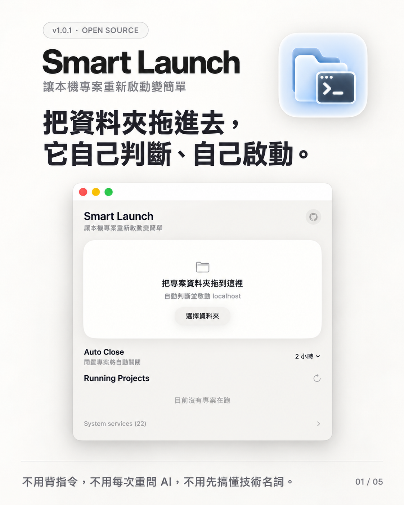
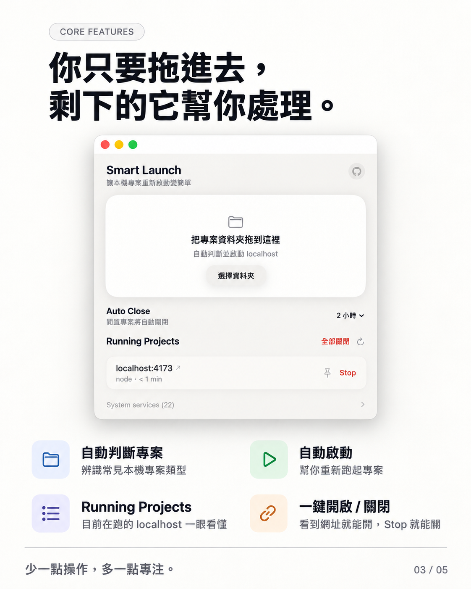
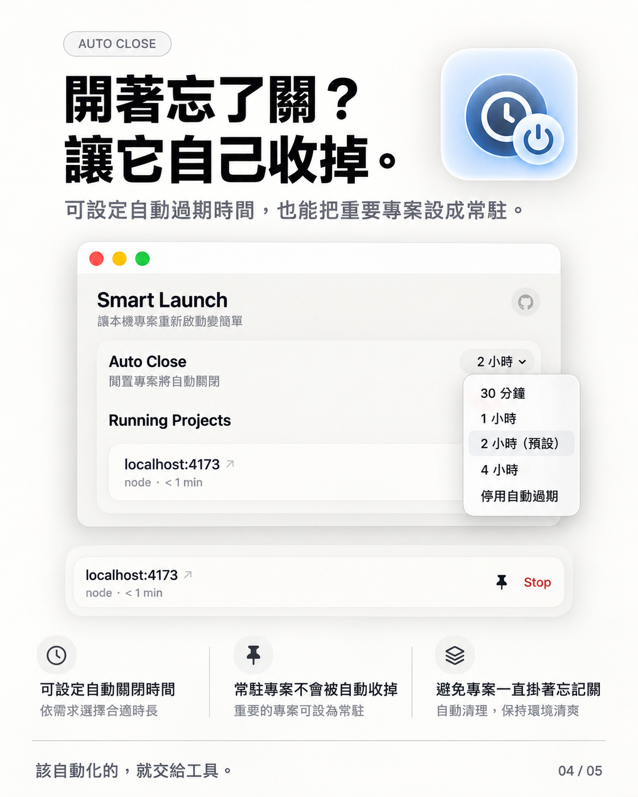

# Smart Launch

**不用記得、不用問 AI、不用打指令——拖進去，它自己判斷、自己跑起來。**

一個 macOS 小工具：把專案資料夾拖進去，它會自動偵測是什麼類型的專案，在 Terminal 幫你啟動，並且可以看到目前所有正在跑的 localhost 服務、隨時一鍵關閉。

拖曳進去啟動，寫 vibecoding 專案的時候不用每次都自己想指令、開 Terminal、找 port。



<p float="left">
  
  
  
</p>

## 為什麼做這個

AI 越來越強之後，很多本來不寫程式的人也開始「vibecoding」——靠 AI 一路對話把專案生出來。但這些專案通常是跑在本機的 localhost，Terminal 一關、電腦一睡眠，服務就斷了。

問題是：不懂程式的人根本不知道怎麼重新啟動。常見的做法是回頭找 AI，把資料夾路徑貼過去、描述一次「這是什麼專案」，再請它幫忙判斷、下指令、開 Terminal——每個資料夾都要重來一次，浪費時間也浪費 token。專案一多，連自己都記不得哪個資料夾是哪個技術棧、該用什麼指令跑。

Smart Launch 想解決的就是這件事：**不用記得資料夾是什麼、不用問 AI、不用打指令**，直接把資料夾拖進去，它自己判斷是 Node、Python、Docker 還是別的，直接幫你在 Terminal 跑起來、開瀏覽器。累積了很多 vibecoding 專案的人，尤其適合。

## 功能

- **拖曳啟動**：把資料夾拖進視窗，或拖到 Dock 圖示上，自動偵測專案類型並在 Terminal 執行對應指令
- **支援的專案類型**：Node.js（npm / pnpm / yarn / bun）、靜態網頁、Python（Django / FastAPI / Flask）、Ruby / Rails、Go、Rust、Docker Compose、Makefile、Deno、PHP、Flutter、Java / Kotlin（Gradle / Maven）、.NET、Chrome 擴充功能、原生 macOS App（`.app` / Xcode 專案 / Swift Package），找不到明確線索時會找 `start.sh` / `run.sh` / `dev.sh`
- **即時服務列表**：顯示目前所有 localhost 上跑的開發伺服器，多久前啟動的、按了就能開瀏覽器
- **一鍵關閉**：單一服務關閉，或「全部關閉」一次清空
- **自動過期**：可設定多久沒手動處理就自動關閉（避免忘記關），也可以把特定服務標記「常駐」跳過
- **Docker 自動處理**：偵測到 Docker Compose 專案但 Docker 沒開時，自動幫你啟動 Docker Desktop 並等待就緒
- **`ports` 指令**：在任何 Terminal 輸入 `ports`，看目前 localhost 有什麼在跑（開發伺服器 / 系統背景服務分開顯示）
- **自動更新提示**：開啟 App 時會檢查 GitHub 上的最新版本，有更新會在上方顯示提示，點一下就能前往下載

## 安裝

需要 macOS 12+。有兩種方式：

### 方式一：直接下載（不用寫程式）

1. 到 [Releases](https://github.com/ST6AR1/smart-launch/releases/latest) 下載最新的 `SmartLaunch-x.x.x.dmg`
2. 打開 DMG，把 `SmartLaunch.app` 拖到 `Applications`
3. 第一次打開會跳出「無法驗證開發者」的警告（因為這是免費開源專案，沒有付費的 Apple 開發者憑證）——在 Finder 裡**按住 Control 點兩下 App → 選「打開」**，或到「系統設定 → 隱私權與安全性」裡找到允許打開。之後就不會再跳出來了

### 方式二：從原始碼安裝（需要 Xcode Command Line Tools）

```bash
xcode-select --install   # 如果還沒裝過
git clone https://github.com/ST6AR1/smart-launch.git
cd smart-launch
./install.sh
```

`install.sh` 會：
1. 編譯 `SmartLaunch.app` 並裝到 `~/Applications`
2. 把 `smart-launch.sh` / `ports.sh` 裝到 `~/bin/smartlaunch/`
3. 在 `~/.zshrc` 加上 `ports` / `ports-watch` 指令（方式一的 DMG 安裝沒有這個指令）

只想重新編譯 App（不動 shell 設定）：

```bash
./build.sh
```

打包成可發布的 DMG：

```bash
./make-dmg.sh
```

## 使用方式

- 打開 `SmartLaunch.app`，把專案資料夾拖進視窗中間那塊白色區域
- 或直接把資料夾拖到 Dock 上的 SmartLaunch 圖示
- 開新的 Terminal 分頁，輸入 `ports` 看目前有什麼在跑

## 專案結構

```
App/               SwiftUI + AppKit 原始碼（單一 main.swift）
bin/               smart-launch.sh（偵測與啟動邏輯）、ports.sh（列出 localhost 服務）
icon/              App 圖示、GitHub 圖示原始檔
docs/              README 用的截圖
build.sh           編譯成 SmartLaunch.app
install.sh         編譯 + 安裝 + 設定 shell alias
make-dmg.sh        編譯 + 打包成可發布的 .dmg
```

## 發布新版本

改完程式碼、確認沒問題後：

1. 更新 `App/main.swift` 裡的 `currentVersion` 常數，跟 `App/Info.plist` 的 `CFBundleShortVersionString` 改成一樣的版號
2. Commit、push
3. 打 tag 建立 GitHub Release：
   ```bash
   gh release create v1.0.2 --title "v1.0.2" --notes "這次改了什麼"
   ```

已經裝過舊版的人，下次打開 App 就會看到更新提示。

## 授權

MIT License，詳見 [LICENSE](LICENSE)。

---

由溫Wen 與 claude寶寶 聯合製作 ⌯^⦁𖥦⦁^⌯
GitHub [@ST6AR1](https://github.com/ST6AR1)
